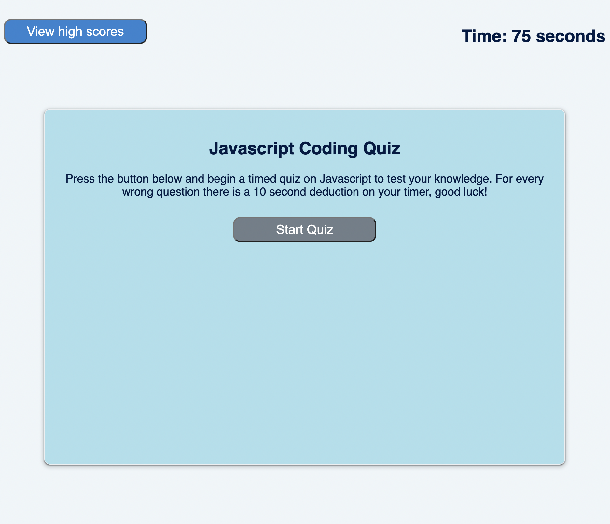

# JavaScriptQuiz
This application provides a timed quiz on JavaScript fundamentals that stores high scores.

## Description

This application provides a quiz on JavaScript code. For every wrong question, 10 seconds is deducted from the timer. At the end of every quiz the user can provide initials to be saved along with their score. Scores and initials can be viewed or reset from the high score page. 

[Link to JavaScript Quiz](https://kthames.github.io/JavaScriptQuiz/)

## Authors

Katherine Thames - k.thames@me.com
